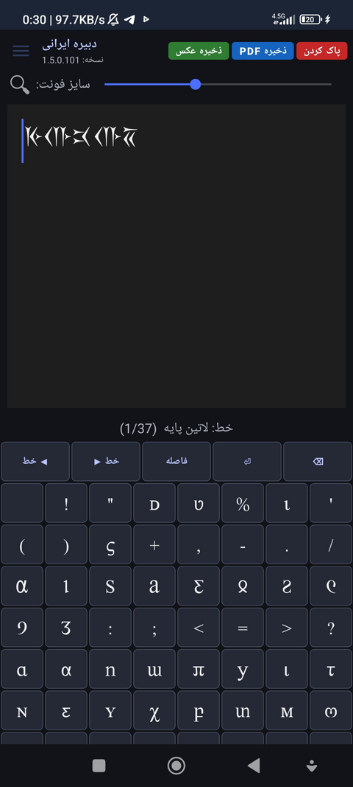
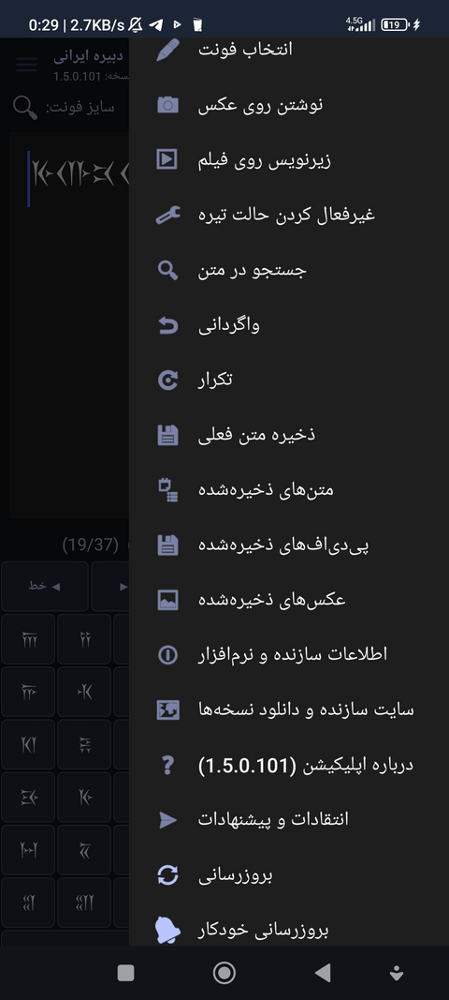
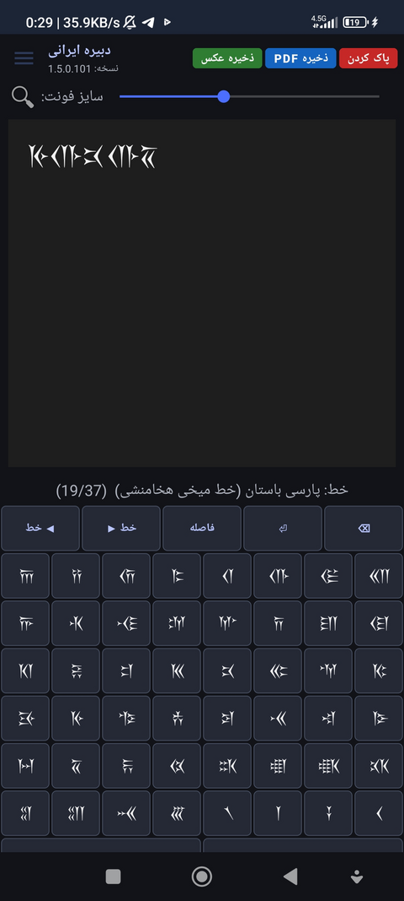
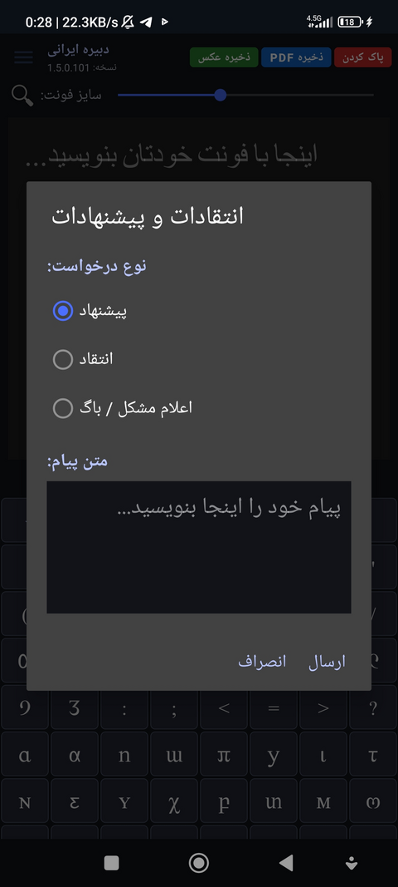
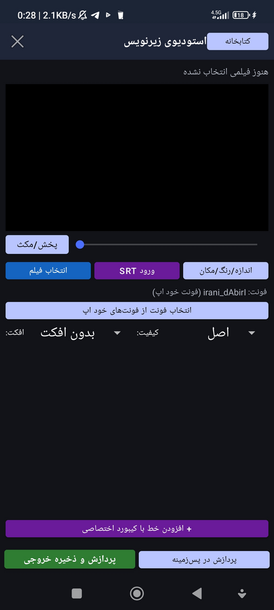

# دبیره ایرانی

کیبورد و واژه‌پرداز دبیره‌های کهن ایرانی، با پشتیبانی از خط میخی پارسی باستان، پهلوی، اوستایی، مانوی و ده‌ها دبیره دیگر.

---

## 📸 تصاویر اپلیکیشن

  
  
  
  
  

---

## 📥 دانلود

**نسخه فعلی: `1.9.9.138`**

### [⬇️ دانلود مستقیم APK](https://github.com/ssanssak-hub/Ancient-Iranian-script-download-/releases/latest/download/dabire_irani_iranian_script.apk)

برای مشاهده سایر نسخه‌ها به [صفحه Releases](https://github.com/ssanssak-hub/Ancient-Iranian-script-download-/releases) مراجعه کنید.

---

## 🆕 تغییرات آخرین نسخه

### ✨ ویژگی‌های جدید 
- 🐬 افزوده شدن دکمه بروزرسانی خودکار
- 💫 افزودن چندین افکت زیرنویس نسبت به نسخه‌های پیشین
- 💯 افزوده شدن پردازش در پس‌زمینه برای زیرنویس‌ها
- 💥 افزودن کاراکترهای کمتر شناخته‌شده خط میخی پارسی باستان
- ✨ افزوده شدن آیکون‌های حذف و مشاهده برای خروجی زیرنویس‌شده
- ⚡ افزایش قواعد در فونت برای نمایش بهتر دبیره ایرانی
- 🚨 قابلیت انتخاب یک یا چند فیلم برای اعمال زیرنویس
- 🔥 افزوده شدن انتخاب تصویر پس زمینه و اعمال حالت بر روی آن
- 🎲 افزوده شدن دانلود تم برای اعمال بر روی اپلیکیشن
- 🗺️ افزوده شدن نسخه وب آنلاین و آفلاین
- 📝 افزوده شدن رنگ های دلخواه به متون اپلیکیشن
- 🛰️ افزوده شدن نرم افزار به بازار و مایکت و بزودی در play store
- 💢 تبدیل متن به دبیره‌های باستانی: منوی «تبدیل متن به دبیره‌های باستانی» برای هفت دبیره (پارسی باستان، اوستایی، پارتی، پهلوی کتیبه‌ای، پهلوی زبوری، مانوی، آرامی) نتیجه رو زنده نشون می‌ده. می‌تونی کپی کنی یا توی ویرایشگر اصلی درج کنی. تبدیل تقریبیه، نه آوانویسی تاریخی دقیق.
- 🦾 کارت اسم: دکمه «ساخت کارت اسم» توی همون صفحه، با پنج سبک (یکی‌شون استیکر شفاف). عکس ذخیره می‌شه و توی «عکس‌های ذخیره‌شده» هم دیده می‌شه.
- 🏙️ قالب‌های آماده: توی «نوشتن روی عکس» دکمه «قالب‌های آماده» با شش قالب (نوروز، یلدا، تولد، دعوت‌نامه، جمله انگیزشی، تبریک). بعد از انتخاب، متن و رنگ و اندازه قابل ویرایشه.
- 🛑 تصویر شفاف: دکمه «استیکر شفاف» توی همون صفحه بوم ۵۱۲×۵۱۲ شفاف می‌ده. متن خود ویرایشگر اصلی رو هم از منوی «ذخیره PNG شفاف (استیکر)» می‌تونی بدون پس‌زمینه خروجی بگیری.
- 🎀 کاراکترهای اخیر و محبوب: زیر ردیف کنترلی کیبورد دو ردیف اضافه شده. با نگه داشتن انگشت روی هر کاراکتر، به محبوب‌ها اضافه یا ازش برداشته می‌شه. هر ردیف تا ۷ کاراکتر جا داره.
- 🕹️ پشتیبان‌گیری و بازیابی: دو آیتم تازه توی منو، با فایل zip شامل متن‌های ذخیره‌شده و تنظیمات. بازیابی متن‌های هم‌نام رو بازنویسی نمی‌کنه. عکس‌ها، PDFها و فیلم‌ها توی پشتیبان نیستن.
- 🏹 جدول آموزشی: آیتم «جدول آموزشی دبیره‌ها» با توضیح تاریخی و معادل لاتین و فارسی هر نشانه. با لمس هر سطر، نشانه کپی می‌شه.
- 🎂 پریست زیرنویس: توی دیالوگ تنظیمات زیرنویس دو دکمه «ذخیره به‌عنوان پریست» و «پریست‌ها» اضافه شد. صفحه زیرنویس از قبل پیش‌نمایش زنده روی ویدیو داشت و با پریست هم به‌روز می‌شه
  
### 🐛 رفع باگ
- ♻️ رفع برخی مشکلات در نمایش کاراکترها نسبت به نسخه‌های قبلی
- 🎉 رفع اشکال در تم‌ها، افزوده شدن تم‌های جدید و یکپارچگی تم‌ها در سراسر اپلیکیشن
- 🌐 رفع باگ اختلال در نصب نرم افزار از طریق بروز رسانی دستی و خودکار
- 🦠 رفع باگ های ساختاری و UX
- 🎆 رفع باگ و اشکالات در نسخه وب آنلاین و آفلاین
  
### 🔧 بهبودها
- ✅ بهبود استودیو زیرنویس اپلیکیشن نسبت به نسخه‌های پیشین
- 👑 بهبود تایپ و سرعت اپلیکیشن هنگام تایپ و رندر فیلم
- 🪄 بهبود اعمال تم ها در حالت تیره و روشن
- 🧑‍💻 بهبود نمایش کاراکتر های موجود در فونت و افزودن رنگ های انتخابی به متون اپلیکیشن 

---

## ✨ ویژگی‌ها

- پشتیبانی از ده‌ها دبیره کهن ایرانی
- کیبورد اختصاصی با فونت انتخابی
- زیرنویس‌گذاری روی فیلم
- نوشتن روی عکس
- خروجی PDF و تصویر
- حالت تیره
- رابط کاربری کاملاً فارسی

---

## 📱 نصب

1. فایل APK را دانلود کنید
2. در تنظیمات گوشی، اجازه نصب از **منابع ناشناس** را فعال کنید
3. روی فایل APK بزنید و نصب کنید

> **نکته:** این اپلیکیشن خارج از Google Play توزیع می‌شود، بنابراین اندروید ممکن است هشدار «منبع ناشناس» نمایش دهد. این کاملاً طبیعی است.

**نیازمندی:** اندروید ۷ (API 24) یا بالاتر

---

## 📢 ارتباط با ما

- 📣 کانال تلگرام: [@dabireirani](https://t.me/dabireirani)
- 🐛 گزارش باگ: [Issues](https://github.com/ssanssak-hub/Persian-font-keyboard-/issues)

---

## 🔒 امنیت و شفافیت

- ✅ کاملاً **رایگان** و **بدون تبلیغ**
- ✅ **بدون دسترسی به اطلاعات شخصی** شما
- ✅ کد منبع به‌صورت شفاف توسعه داده می‌شود
- ✅ تغییرات هر نسخه در [صفحه Releases](https://github.com/ssanssak-hub/Ancient-Iranian-script-download-/releases) قابل مشاهده است

---

**آخرین به‌روزرسانی: 2026-10-01** • **ساخته شده با ❤️**

